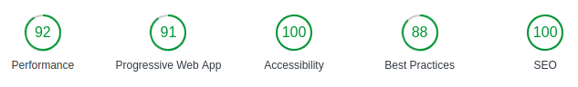

# Fressen

[](https://david-dm.org/volcain-io/fressen)  [](https://david-dm.org/volcain-io/fressen?type=dev)

[](https://github.com/airbnb/javascript) [](https://github.com/volcain-io/fressen/blob/master/LICENSE)

> A restaurant review mobile-ready web application with seamless offline experience called "Fressen".

## Why "Fressen"?

It's german and the meaning is to eat away something.

## Getting started

A quick introduction of the minimal setup you need to get up running this project.

```shell
git clone https://github.com/volcain-io/fressen.github
cd fressen/
```

### Dependency

The project depends on [fressen-dev-server](https://github.com/volcain-io/fressen-dev-server). Please check install notes on the project's README.

### What do I do from here?

1. Follow the instructions on [fressen-dev-server](https://github.com/volcain-io/fressen-dev-server) and start the dev server
2. Run the build process on the root project directory (`fressen`): `npm run build`
3. Start up a simple HTTP server to serve up the site distrubution files (inside `dist` folder) on your local computer.
 - On **Google Chrome** just install the [Web Server for Chrome]() extension. Launch the extension & choose the `dist` folder as your document root, configure the port number (e.g. 8001) and you're done.

#### You should now have access to the web app

With your server up & running, visit the site [http://localhost:8001](http://localhost:8001) (change port number according to your configuration on the previous step).

### Commands

- To only build in production (it dumps the files in `dist` folder)

```shell
npm run build
```

- To start in develop with hot reloading (includes watchify for client-side code changes):

```shell
npm run start:dev
```

### Features

:heavy_check_mark: Offline support via Service Worker
:heavy_check_mark: Mark restaurant as favorite
:heavy_check_mark: Add review for a selected restaurant (with offline support)

## Lighthouse

Results of the Audit



## Developing

### Built With

[HTML5](https://www.w3.org/TR/html5/)
[CSS3](https://www.w3.org/Style/CSS/)
[JavaScript](https://developer.mozilla.org/en-US/docs/Web/JavaScript)

### Prerequisites

In order to retrieve data you have to install [fressen-dev-server](https://github.com/volcain-io/fressen-dev-server). Please check installation notes on the project's [README](https://github.com/volcain-io/fressen-dev-server).

### Setting up Dev

Clone the repository:

```shell
git clone https://github.com/volcain-io/fressen.github
cd fressen/
npm install
```

Start `npm` command

```shell
cd fressen/
npm run start:dev
```

The Gulp build tool than creates a new, completed `dist` directory with all the optimizations you need and will open the web app automatically in your default browser (with *Live Editing* enabled).

Happy coding!

## To Do

- [x] Offline First via Service Worker API
- [x] Add IntersectionObserver support
- [x] Responsive Design
- [x] Accessibility according to WAI-ARIA
- [x] Mark restaurant as favorite
- [x] Submit review for selected restaurant
- [ ] Notify user on success/error of any action
- [ ] convert to SPA
- [ ] Add .env configuration

## Contributing

Contributions are welcome. Open a pull request with whatever topic you like. I'll get in touch with you.

## Validation

The HTML and CSS Code is validated against the [W3C's Validators](http://validator.w3.org/).

## Style guide

The code style relies on [Prettier](https://prettier.io).

## Licensing

[MIT License](LICENSE)
